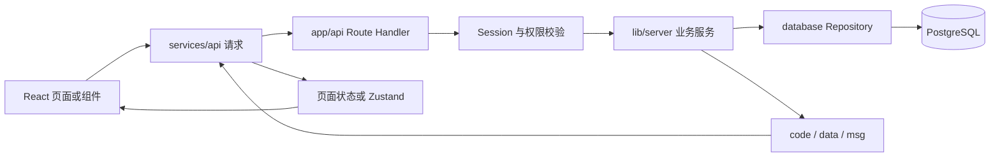
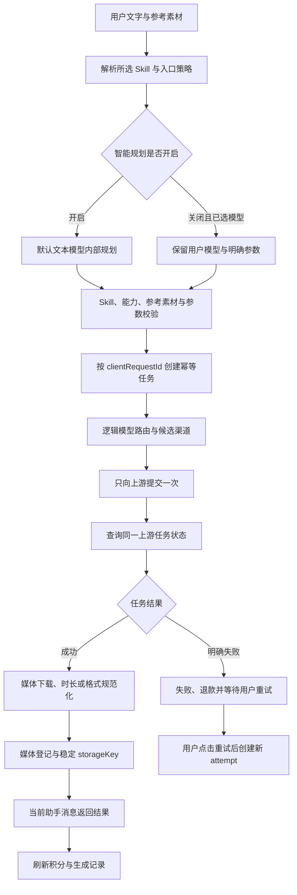
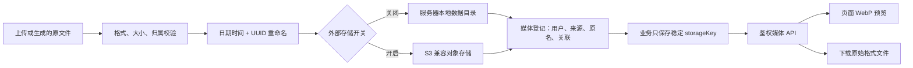
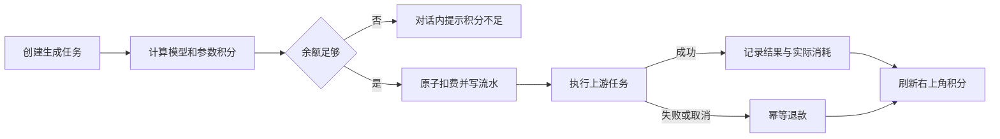
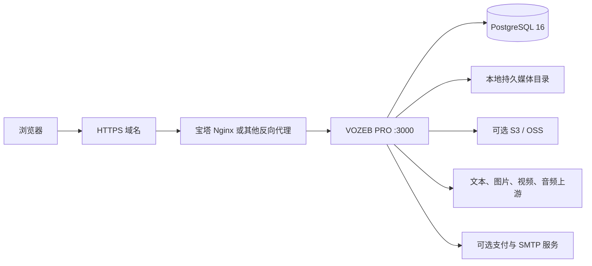
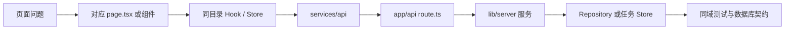

# 项目结构与流程

本文用于回答“功能在哪里、请求怎么走、数据保存到哪里”。项目采用 Next.js 全栈结构，浏览器只负责界面和瞬时状态；业务规则、密钥、模型路由、计费和持久化全部留在服务端。

## 仓库目录

```text
VOZEB-PRO/
|- .github/workflows/       质量检查、主应用镜像和文档镜像工作流
|- docs/                    Fumadocs 文档站
|  |- content/docs/         产品、部署、后端与进度文档
|  |- public/community/     QQ 群等项目社区素材
|  |- public/screenshots/   文档使用的脱敏页面截图
|  `- src/                  文档站页面、搜索和导航
|- web/                     VOZEB PRO 主应用
|  |- public/               Logo、图标等静态资源
|  |- scripts/              standalone 启动与运维脚本
|  `- src/
|     |- app/               页面、布局和 API Route Handler
|     |- components/        跨页面组件与管理后台界面
|     |- hooks/             跨页面交互与生成流程 Hook
|     |- lib/               领域契约、认证和服务端业务
|     |- services/api/      浏览器访问本站 API 的客户端
|     |- stores/            Zustand 全局瞬时状态
|     `- styles/            跨页面样式
|- .env.example             环境变量模板，不包含真实密钥
|- Dockerfile               主应用 standalone 生产镜像
|- docker-compose.yml       主应用和 PostgreSQL 的标准编排
|- docker-compose.baota.yml 宝塔 PostgreSQL + host 网络编排
|- docker-compose.external-db.yml 外部数据库编排
|- docker-compose.lowmem.yml      低内存部署编排
|- render.yaml              Render Blueprint
|- AGENTS.md                项目开发、架构、UI 和测试约束
|- CONTRIBUTING.md          Issue、PR、本地开发和质量检查说明
|- LICENSE / CLA.md         AGPL-3.0 与贡献者授权协议
|- SECURITY.md              私密漏洞提交与支持版本说明
|- VERSION                  当前发行版本
`- CHANGELOG.md             版本级变更记录
```

`.env`、`.data/`、数据库、媒体数据、备份、日志、`.next/`、`node_modules/`、本地 AI 工作目录和临时截图都不是源码，不应上传 GitHub。

## Web 目录职责

| 路径                           | 职责                                                                 |
| ------------------------------ | -------------------------------------------------------------------- |
| `web/src/app/(user)/`          | 登录后的 Agent、图片、视频、Canvas、短剧、素材、提示词和个人中心页面 |
| `web/src/app/admin/`           | 管理员入口、运营后台和初始化配置中心                                 |
| `web/src/app/api/`             | HTTP 入参、鉴权、服务调用和 `{ code, data, msg }` 响应映射           |
| `web/src/components/`          | 全局布局、通用业务组件和管理后台视图                                 |
| `web/src/hooks/`               | 多页面复用的生成、会话、复制、下载和状态同步逻辑                     |
| `web/src/services/api/`        | 浏览器到本站 Route Handler 的类型化请求                              |
| `web/src/stores/`              | 登录用户、主题、公开配置和素材等共享客户端状态                       |
| `web/src/lib/*.ts`             | Canvas、短剧、素材、模型、支付和创作运行时领域契约                   |
| `web/src/lib/auth/`            | Session、用户、权限、积分和公开设置入口                              |
| `web/src/lib/server/`          | 业务服务、任务编排、Provider 适配、计费、媒体与安全逻辑              |
| `web/src/lib/server/database/` | PostgreSQL schema、参数化 Repository 和文件 Provider 回退            |
| `web/src/styles/`              | 全局布局和跨页面主题样式，页面私有样式仍由组件管理                   |
| `web/src/**/*.test.ts(x)`      | 与实现同域放置的 Vitest 单元和契约测试                               |

## 关键文件入口

| 文件                                                | 打开它能看到什么                                            |
| --------------------------------------------------- | ----------------------------------------------------------- |
| `web/src/app/layout.tsx`                            | 应用根布局、站点元信息、主题与全局 Provider 入口            |
| `web/src/app/(user)/layout.tsx`                     | 登录用户工作区的鉴权、安装状态判断和统一壳层                |
| `web/src/app/admin/page.tsx`                        | 管理后台入口与一级业务分区                                  |
| `web/src/app/api/**/route.ts`                       | 本站 API 的参数读取、Session/管理员鉴权、服务调用和响应映射 |
| `web/src/components/layout/app-workspace-shell.tsx` | 用户工作区侧栏、顶部栏和内容滚动边界                        |
| `web/src/services/api/request.ts`                   | 浏览器请求本站 API 的通用响应解析与错误映射                 |
| `web/src/lib/server/agent-run-executor.ts`          | Agent Run 的认领、执行、终态处理和失败记录                  |
| `web/src/lib/server/logical-model-router.ts`        | 逻辑模型到真实渠道、上游模型和候选优先级的解析              |
| `web/src/lib/server/generation-task-store.ts`       | 统一生成任务状态、并发、认领、取消和统计                    |
| `web/src/lib/server/object-storage-service.ts`      | S3 写入、签名读取、对象管理和本地媒体迁移                   |
| `web/src/lib/server/local-media-registry.ts`        | 媒体用户归属、来源、原名、存储 Provider 和业务关联登记      |
| `web/src/lib/server/database/schema.ts`             | PostgreSQL 表、索引、约束和初始化结构                       |
| `web/src/lib/server/database/repositories.ts`       | 数据库 Repository 聚合入口                                  |
| `web/scripts/start-standalone.mjs`                  | Docker/standalone 生产进程启动和运行目录准备                |
| `web/scripts/reset-admin-password.mjs`              | 服务端管理员密码重置                                        |
| `web/scripts/reset-admin-mfa.mjs`                   | 文件/PostgreSQL Provider 的管理员 MFA 恢复与 Session 撤销   |
| `web/scripts/release-check.mjs`                     | 版本、品牌、文档、Git 跟踪文件和敏感文件发布检查            |
| `.github/workflows/quality.yml`                     | Web/Docs 依赖安装、类型检查、测试、格式检查和生产构建       |
| `.github/workflows/docker-image.yml`                | 主应用 amd64/arm64 镜像构建、GHCR 推送和 manifest 合并      |
| `.github/workflows/docs-docker-image.yml`           | 文档站 amd64/arm64 镜像构建、GHCR 推送和 manifest 合并      |

页面目录中的 `page.tsx` 是页面入口；同目录 `use-*.ts(x)`、`*-records.ts` 或 `components/` 通常承载该页面私有控制逻辑。服务端同名 `*.test.ts(x)` 用于保护任务、计费、媒体、数据库和协议边界。

## 主要服务边界

| 模块                       | 负责内容                                                                          |
| -------------------------- | --------------------------------------------------------------------------------- |
| `creative-runtime-*`       | 创作会话、消息、稳定资产、Run 和事件持久化                                        |
| `agent-run-*`              | `/create` 统一 Agent 的计划校验、Skill 策略、媒体子任务调度、事件、结果回写与恢复 |
| `logical-model-router.ts`  | 逻辑模型到真实渠道、上游模型和候选优先级的解析                                    |
| `*-task-store.ts`          | 文本、图片、视频、音频任务的状态、幂等和退款边界                                  |
| `generation-task-store.ts` | 统一生成任务状态机、并发约束和任务认领                                            |
| `generation-log-*`         | 用户生成记录、媒体结果和运营统计                                                  |
| `reference-asset-*`        | 参考素材上传、登记、公开读取和给上游使用的兼容 URL                                 |
| `local-media-*`            | 本地媒体登记、分类、引用保护、读取和清理                                          |
| `object-storage-*.ts`      | S3 兼容配置、对象访问、签名、对象管理和本地媒体迁移                               |
| `billing-*` / `payment-*`  | 商品、订单、支付、退款、对账和积分入账                                            |
| `admin-mfa-service.ts`     | 管理员 TOTP 设置、登录挑战、密文状态与 Session 撤销                               |
| `canvas-project-*`         | Canvas 项目校验、保存和用户隔离                                                   |
| `drama-project-*`          | 短剧剧本、资产、分镜、版本、成本和成片状态                                        |

## 标准页面请求



Route Handler 不直接堆业务规则或 SQL。页面也不直接连接数据库或外部模型，真实密钥只在服务端解密和使用。

## Agent 与生成任务



平台规划提示词、模型选择理由、创作简报、物料计划和视觉复盘只用于内部执行，不写入生成型对话。用户手动选择模型并给出明确提示词时，不再由规划器改选模型，但仍必须经过 Skill、能力、参考素材、计费和安全校验。

轮询只查询已经创建的任务，不能因为查询超时或暂未完成而再次调用创建接口。只有上游明确返回失败并且用户点击“重试”，才允许创建新的 attempt，避免重复消耗上游额度。

## 媒体存储与访问



外部存储开关只影响新文件写入位置；历史文件始终按自身 `storage_provider` 读取。删除前必须检查创作会话、素材库、Canvas、短剧和生成记录引用，不能留下静默失效资源。

## 积分与退款



## 生产部署



标准 Compose 自带 PostgreSQL；宝塔 Compose 使用宿主机 PostgreSQL；外部数据库与低内存 Compose 只运行应用。所有模式共用同一代码和数据契约。

## 查问题的最短路径



例如 `/create` 图片任务历史异常，应从页面私有 Hook 找到 `services/api/creative.ts`，再进入 Creative Conversation / Agent Run Route、任务 Store、生成记录和媒体登记；不要在页面层直接增加数据库或上游兼容分支。底层 `services/api/image.ts` 与 `api/image-tasks` 仍负责真实图片子任务，不代表存在独立图片工作台页面。
